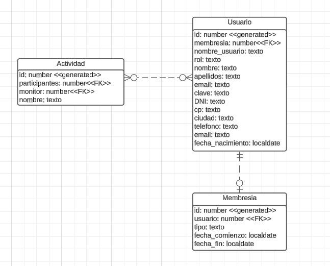
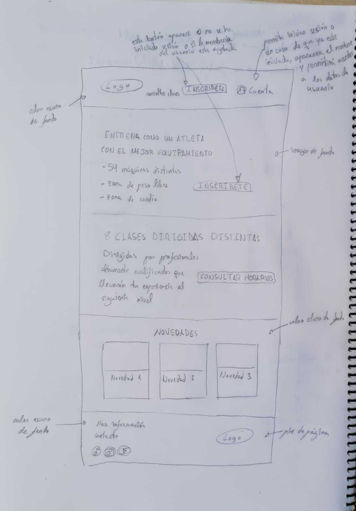
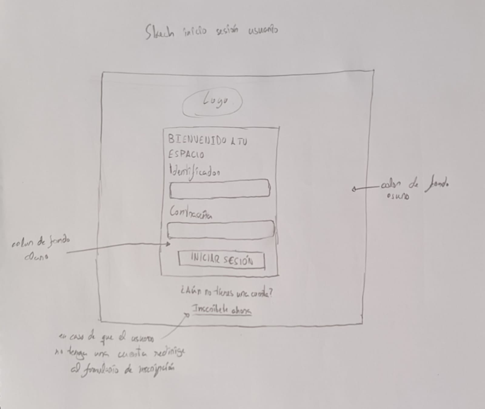
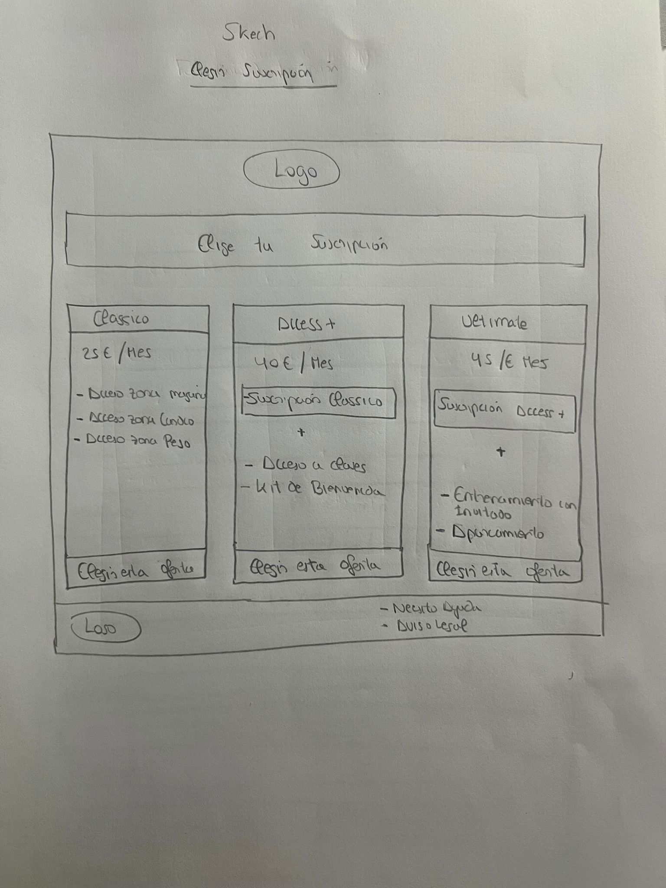
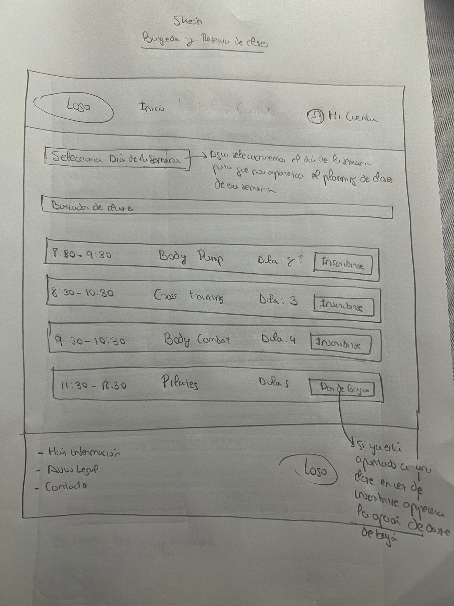

# PowerFIT - Fitness Center

Diseño de las estructuras de las páginas buscaClases, eligeSuscripción y formulario de inscripción 
de la web del Gimnasio Power FIT.

## Historias de usuario:
- El usuario podrá buscar clases de forma sencilla y rápida [Juan Manuel Arriaza Rey]
- El usuario podrá elegir la suscripción que más se ajuste a sus necesidades [Juan Manuel Arriaza Rey]
- El usuario podrá iniciar sesión en la web [Ignacio Delgado Lobelle]
- El usuario podrá acceder a la web y ver la información de la misma [Ignacio Delgado Lobelle]
- El usuario podrá inscribirse en las clases que desee [Juan Manuel Arriaza Rey]

## Construido con:
- HTML - Diseño de estructuras
- CSS - Estilos

## Miembros del equipo:
- Juan Manuel Arriaza Rey
- Ignacio Delgado Lobelle

## Entidad relación del proyecto

## StoryBoard
- Página de inicio

- Página de login

- Elección de suscripción

- Formulario de inscripción

- Buscador de clases

