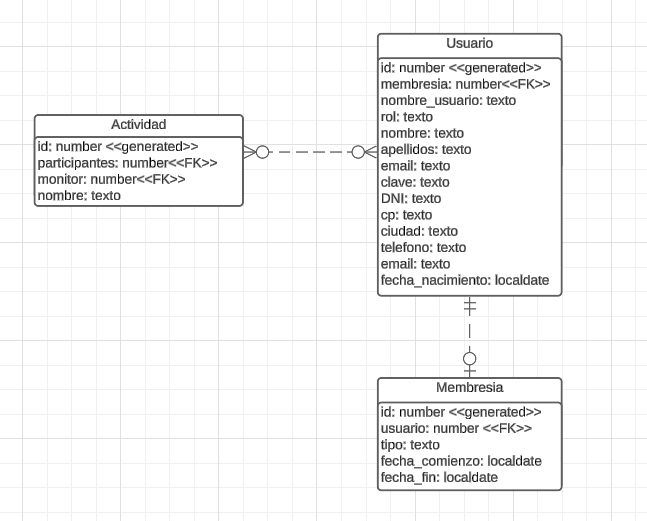
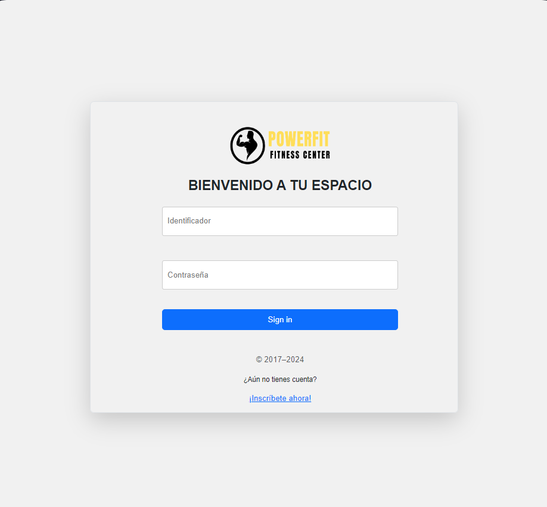
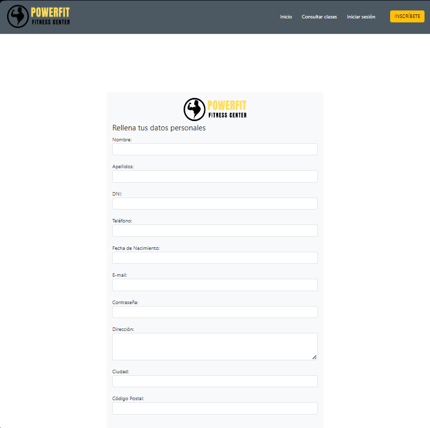
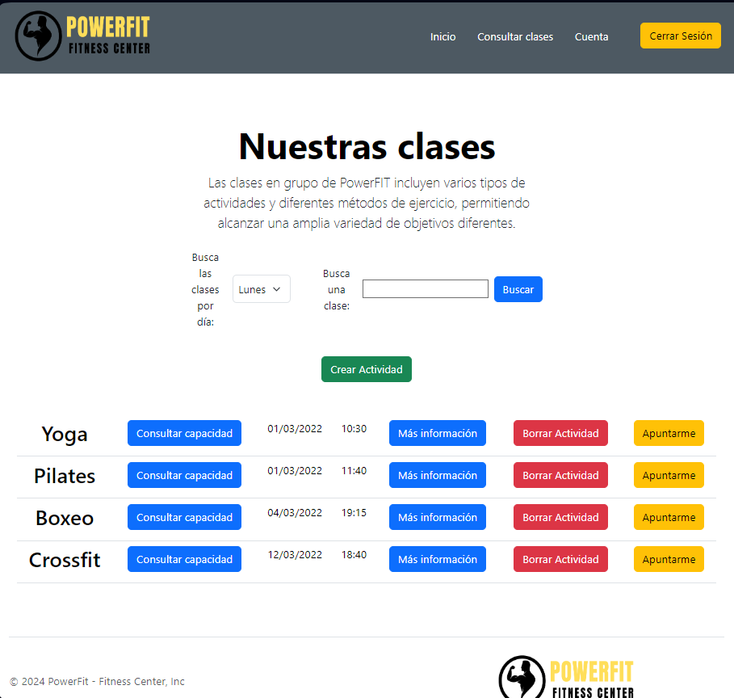
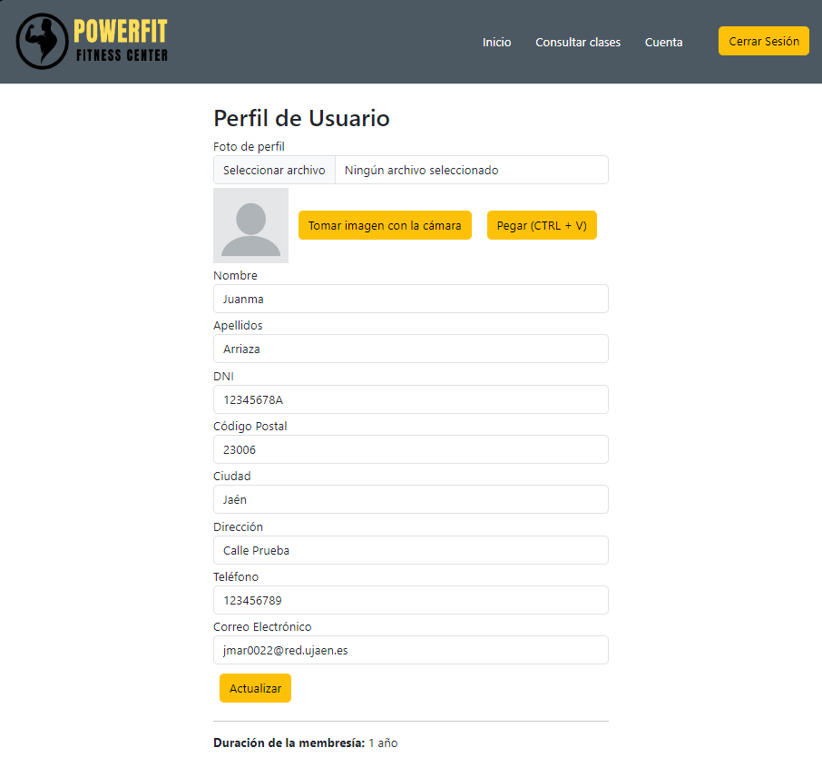

# PowerFIT - Fitness Center

PowerFIT es un gimnasio que cuenta con una aplicación web. Esta aplicación permite a sus usuarios inscribirse y 
iniciar sesión. Una vez iniciada sesión permite consultar las clases disponibles y sus horarios, así como reservar
una plaza en las mismas. Además, a la hora de inscribirse permite al usuario elegir la suscripción que más se ajuste
a sus necesidades entre tres tipos de subscripciones.

## Historias de usuario:
- El usuario podrá buscar clases de forma sencilla y rápida [Juan Manuel Arriaza Rey]
- El usuario podrá elegir la suscripción que más se ajuste a sus necesidades [Juan Manuel Arriaza Rey]
- El usuario podrá iniciar sesión en la web [Ignacio Delgado Lobelle]
- El usuario podrá acceder a la web y ver la información de la misma [Ignacio Delgado Lobelle]
- El usuario podrá inscribirse en las clases que desee [Juan Manuel Arriaza Rey]

## Construido con:
- HTML - Diseño de estructuras
- CSS - Estilos

## Miembros del equipo:
- Juan Manuel Arriaza Rey
- Ignacio Delgado Lobelle

## Entidad relación del proyecto

- Usuario, representa a los usuarios de la aplicación. [Juan Manuel Arriaza Rey]
- Actividad, representa cada una de las clases a reservar. [Ignacio Delgado Lobelle, Juan Manuel Arriaza Rey]
- Membresía, representa los tipos de suscripción que puede elegir el usuario. [Ignacio Delgado Lobelle, Juan Manuel 
Arriaza Rey]

## Resultado final del proyecto
- Página de inicio
  
- Página de login
  
- Elección de suscripción

- Formulario de inscripción
  
- Buscador de clases

- Perfil del usuario
  

